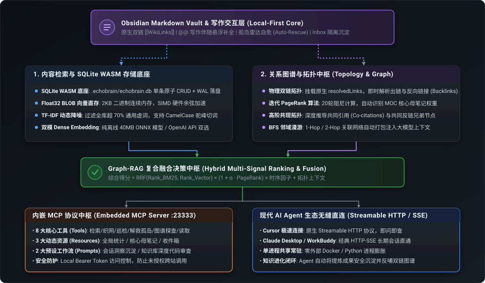
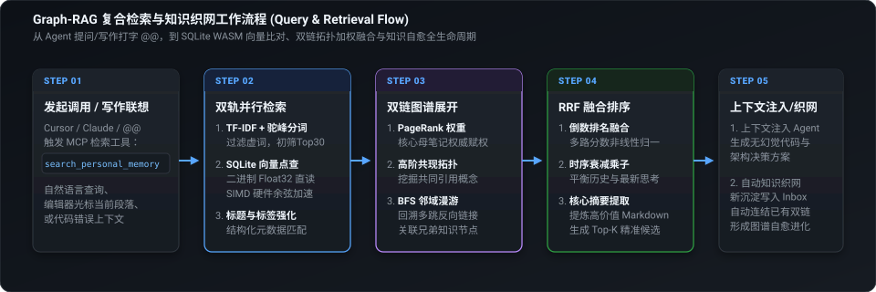

# EchoBrain Local

> **让 Obsidian 成为 Agent 的本地大脑。**  
> *Make Obsidian the Local Brain for AI Agents.*

[](LICENSE)
[](https://modelcontextprotocol.io/)
[](https://obsidian.md/)
[](https://www.typescriptlang.org/)

EchoBrain Local 是一个运行在 Obsidian 内部的本地优先（Local-First）模型上下文协议（Model Context Protocol, MCP）插件。

它的核心不是“做一个知识库”，也不是“做一个 MCP 工具集合”，而是：  
**让外部 AI Agent 能够真正读取、理解、关联和沉淀你在 Obsidian 中的个人知识。**

无需配置 Node.js 运行时或外部矢量数据库，只需在 Obsidian 内部开启插件，即可让 **WorkBuddy (腾讯)**、**Cursor**、**Claude Desktop** 等现代 Agent 拥有你的长期经验记忆。

---

## 核心心智模型 (The Mental Model)

```text
┌─────────────────────────────────────────────────────────────┐
│  Obsidian   =  Agent 的长期记忆 (Long-Term Memory)           │
│  EchoBrain  =  连接记忆与 Agent 的神经中枢 (Nervous System) │
│  MCP        =  Agent 调度记忆的突触接口 (Standard Protocol) │
│  Inbox      =  Agent 写入新记忆的安全隔离区 (Safe Entry)    │
└─────────────────────────────────────────────────────────────┘
```

- **记忆主体在本地**：知识库始终由你完全掌控，零数据上云，断网完全可用。
- **神经中枢单进程**：利用 Obsidian 原生渲染进程与文件缓存，无外部 Node 进程膨胀。
- **单向真理原则**：外部 Agent 只能检索已有笔记，新沉淀严格落入 `Inbox/` 收件箱，永不篡改历史文档。

---

## 四维闭环：读、懂、联、沉淀

```
     ┌────────┐        ┌────────┐        ┌────────┐        ┌────────┐
     │ 1. 读  │   →    │ 2. 懂  │   →    │ 3. 联  │   →    │ 4. 沉淀│
     └────────┘        └────────┘        └────────┘        └────────┘
      精准词频          语义向量          图谱拓扑          安全收件
     (BM25/分词)       (ONNX/WASM)      (PageRank)         (Inbox)
```

1. **读 (Precision Read)**：自研代码标识符切词与中文字词滑动窗口（2-gram / 3-gram），毫秒级精准命中函数名、配置项、报错码及专有名词。
2. **懂 (Semantic Understand)**：三级按需嵌入架构——零开销纯词频模式、按需加载 40MB 本地 WebAssembly ONNX 模型（`bge-small-zh-v1.5`），或接入任意兼容 OpenAI / Ollama 的向量 API，穿透字面差异识别模糊意图。
3. **联 (Topological Relate)**：直接挂载 Obsidian 原生 `metadataCache.resolvedLinks`，基于 PageRank 识别知识枢纽（MOC），顺藤摸瓜完成前向引用与反向链接（Backlinks）的多跳展开。
4. **沉淀 (Safe Precipitate)**：在 IDE 中生成的代码架构、技术方案或调试手记，通过 `save_insight` 工具原子写入 `Inbox/` 目录，并即时建立索引，形成知识进化闭环。

---

## 系统架构



---

## Graph-RAG 检索工作流



---

## 快速上手

### 1. 安装插件

将编译生成的产物复制到你的 Obsidian 笔记库插件目录下：

```
<你的笔记库路径>/.obsidian/plugins/echobrain-local/
├── main.js
├── manifest.json
└── styles.css
```

### 2. 启用插件

1. 打开 Obsidian 设置 -> **第三方插件**，在列表中启用 **EchoBrain Local**。
2. 插件就绪后，Obsidian 右下角状态栏将显示常驻监听端口（如 `MCP: 23333`）。
3. 可以在设置面板中按需配置端口、收件箱目录或向量嵌入模式。

---

### 3. 客户端一键接入

无论使用哪款 Agent 客户端，**只需配置同一个本地 HTTP/SSE 服务端地址**，所有客户端共享单进程常驻服务：

#### 接入 WorkBuddy (腾讯)
在 WorkBuddy 左侧栏【连接器 / Connectors】->【自定义连接器】->【配置 MCP】中直接粘贴：
```json
{
  "mcpServers": {
    "echobrain": {
      "type": "http",
      "url": "http://127.0.0.1:23333/sse"
    }
  }
}
```

#### 接入 Cursor
在项目根目录 `.cursor/mcp.json` 或全局设置中配置：
```json
{
  "mcpServers": {
    "echobrain": {
      "url": "http://127.0.0.1:23333/sse"
    }
  }
}
```

#### 接入 Claude Desktop
在 `claude_desktop_config.json` 中配置：
```json
{
  "mcpServers": {
    "echobrain": {
      "url": "http://127.0.0.1:23333/sse"
    }
  }
}
```

---

## 标准 MCP 工具规范

EchoBrain Local 向外部 Agent 暴露 6 个标准协议工具：

| 工具名称 | 功能描述 | 核心参数说明 |
|---|---|---|
| `search_personal_memory` | 检索知识库中的笔记切片与双链关联 | `query` (必需): 自然语言或关键词<br>`mode`: `"hybrid"` \| `"bm25"` \| `"semantic"`<br>`limit`: 返回条数 (默认 5)<br>`expand_graph_hops`: 双链拓展跳数 (默认 1) |
| `save_insight` | 安全写入技术方案或调试经验至收件箱 | `title` (必需): 笔记标题<br>`content` (必需): Markdown 正文<br>`tags`: 标签列表<br>`category`: 分类名称 |
| `find_connections` | 根据正在编辑的代码或文本环境回响关联经验 | `current_context` (必需): 当前代码块或文本片段<br>`limit`: 返回条数限制 (默认 3)<br>`expand_graph_hops`: 关联拓扑扩展跳数 |
| `explore_graph_neighborhood` | 探查某篇笔记在知识库双链网络中的局部拓扑与出入度 | `path` (必需): 目标笔记相对路径<br>`max_hops`: 探索深度 (1 或 2)<br>`limit`: 邻接节点上限 |
| `read_note` | 获取指定笔记完整 Markdown、正向引用与反向链接 | `path` (必需): 目标笔记相对路径 |
| `get_vault_stats` | 获取知识库概况、向量状态与核心母笔记榜单 | 无参数 |

---

## 工程结构

```
EchoBrain/
├── manifest.json              # Obsidian 插件元数据规范
├── versions.json              # 插件版本兼容清单
├── package.json               # 插件项目定义与依赖管理
├── tsconfig.json              # TypeScript 编译配置
├── esbuild.config.mjs         # esbuild 构建打包脚本
├── styles.css                 # 插件设置面板与侧边栏样式
├── cursor_mcp.example.json    # Cursor 接入配置示例
├── workbuddy_mcp.example.json # WorkBuddy 接入配置示例
├── claude_desktop_config.example.json # Claude Desktop 接入示例
├── test-e2e.mjs               # 端到端 Graph-RAG 与网络协议自测套件
├── src/                       # 插件源码核心目录
│   ├── main.ts                # 插件生命周期入口与事件监听
│   ├── engine.ts              # 挂载 Obsidian 原生缓存的 Graph-RAG 引擎
│   ├── server.ts              # 兼容 Streamable HTTP 与 SSE 的多会话服务
│   ├── settings.ts            # 设置面板交互与模型管理
│   ├── view.ts                # 侧边栏实时联想与拓扑视图
│   ├── embeddingService.ts    # 三级嵌入模型服务 (None / Local WASM / API)
│   ├── tokenizer.ts           # 中英文双模分词器 (含 2/3-gram 算法)
│   ├── types.ts               # 核心类型接口定义
│   └── empty-shim.cjs         # WASM 依赖打包垫片
├── docs/                      # 架构图与检索流程图 (SVG)
└── example-vault/             # 开源示例笔记库 (含双链拓扑测试用例)
```

---

## 本地开发与构建

### 环境要求
- Node.js >= 18.0.0
- npm >= 9.0.0

### 常用命令
```bash
# 1. 安装开发依赖
npm install

# 2. 生产环境构建 (生成 main.js)
npm run build

# 3. 运行端到端自动化测试
npm test

# 4. 监听变动热重载
npm run dev
```

---

## 协议与开源许可

本项目基于 [MIT License](LICENSE) 许可协议开源。
