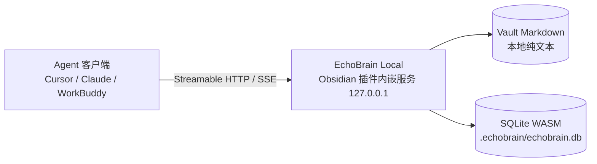

<p align="center">
  <h1 align="center">EchoBrain Local</h1>
  <p align="center">
    <b>让 Obsidian 成为 AI Agent 的本地第二大脑 —— 笔记不出本机，Agent 随时可读、可写、可织网。</b>
  </p>
  <p align="center">
    <a href="https://github.com/dxer/obsidian-echobrain/releases"></a>
    <a href="./LICENSE"></a>
    
    
    
    
  </p>
  <p align="center">
    <a href="#-quickstart5-分钟上手">Quickstart</a> ·
    <a href="#-核心特性场景化">场景特性</a> ·
    <a href="#%EF%B8%8F-工作原理与信任边界">原理与隐私</a> ·
    <a href="#-与其他方案选型对比">方案对比</a> ·
    <a href="#-全量-mcp-协议规范">MCP 规范</a>
  </p>
</p>

<p align="center">
  
</p>

<!-- TODO: 可选录制一张 ≤15 秒 demo.gif 替换此图（打字 @@ 弹出补全 → Cursor 调工具引用笔记） -->

你在 Obsidian 里攒了几年的架构思考与踩坑经验，却在用 Cursor、Claude 写代码时把它们**一段段手动复制粘贴**；  
想让 Agent 拥有长期记忆，要么忍受繁琐搬运，要么把私有笔记上传到不放心的云端；更头疼的是，随手写的新笔记往往沦为无人问津的“孤岛”。

**EchoBrain Local** 将模型上下文协议（MCP）服务与 SQLite WASM 关系型存储直接内嵌进 Obsidian：装上插件，你的 Vault 瞬间成为外部 Agent 可精准调用的本地记忆层与知识网络 —— 全程运行在你自己的电脑上。

> **适合你，如果**：你用 Obsidian 沉淀知识，同时使用 Cursor、Claude Desktop、WorkBuddy 等支持 MCP 的 AI Agent。

---

## 🚀 Quickstart（5 分钟上手）

**前置条件**：Obsidian ≥ 1.4.0（桌面版）、任意支持 MCP 的 Agent 客户端（如 Cursor、Claude Desktop 或 WorkBuddy）。

### 1. 安装插件
从 [GitHub Releases](https://github.com/dxer/obsidian-echobrain/releases) 下载 `echobrain-local.zip`，解压至笔记库插件目录：
```text
<你的笔记库路径>/.obsidian/plugins/echobrain-local/
├── main.js
├── manifest.json
├── styles.css
└── sql-wasm.wasm
```

### 2. 启用内嵌服务
打开 Obsidian → `设置` → `第三方插件` → 开启 **EchoBrain Local**。  
✅ **你应当看到**：Obsidian 状态栏右下角亮起 `🧠 MCP: 23333`。

### 3. 把 Agent 接上（以 Cursor 为例）
在项目根目录 `.cursor/mcp.json` 或全局设置中添加如下配置并保存：
```json
{
  "mcpServers": {
    "echobrain": {
      "url": "http://127.0.0.1:23333/sse"
    }
  }
}
```

<details>
<summary>其他 Agent 客户端配置（Claude Desktop / WorkBuddy）</summary>

**Claude Desktop** (`claude_desktop_config.json`):
```json
{
  "mcpServers": {
    "echobrain": {
      "url": "http://127.0.0.1:23333/sse"
    }
  }
}
```

**WorkBuddy (腾讯)**:
在【连接器 / Connectors】->【自定义连接器】中选择 `HTTP` 类型，URL 填入 `http://127.0.0.1:23333/sse`。

> 🔒 **开启了 Token 鉴权？**：若在设置中启用了【安全访问鉴权】，URL 尾部追加参数即可：`http://127.0.0.1:23333/sse?token=<你的Token>`。
</details>

### 4. 试一句话（体验 Aha Moment）
在 Agent 对话框里直接提问：「**查一下我笔记库里关于跨域配置的踩坑记录，列出核心要点。**」  
✅ **你应当看到**：Agent 自动调用 `search_personal_memory` 工具，精准引用你本地笔记的原话与上下文，给出无幻觉的技术答案。

---

## ✨ 核心特性（场景化）

- 💾 **单条就地秒级写入，彻底告别写放大**：告别改一篇笔记就全盘覆写几兆大 JSON 的卡顿。内置 SQLite WASM 存储底座，`Float32Array` 二进制向量单条就地原子 CRUD，纳秒级落盘。
- 🕸️ **真正读懂知识层次的 Graph-RAG**：基于 PageRank 识别知识库核心母笔记（MOC），结合 512 维向量余弦距离与 TF-IDF 动态降噪，搜出来的绝不是碎屑孤岛，而是体系化的知识链路。
- ✍️ **写作心流伴随补全（输入 `@@` 触发）**：打字过程无需切换窗口，在任何 Markdown 笔记中输入 `@@`，光标下方瞬间弹出智能联想卡片，按下 `Enter` 一键插入 `[[目标笔记]]`。
- 🩺 **孤岛笔记雷达与一键织网自愈（Auto-Rescue）**：侧边栏体检面板秒级揪出未引用的沉睡孤岛与破损死链；算法自动推荐上位关联概念，点击“一键连结”自动将双链写入正文，实现知识网自愈。
- 🔒 **100% 隐私安全，零外部环境膨胀**：纯内嵌单进程运行，只监听本地回环地址 `127.0.0.1`，无需在后台额外挂载 Docker、Python 虚拟环境或开放危险的外网端口。

---

## 🔄 Graph-RAG 检索与融合工作流

<p align="center">
  
</p>

整个检索生命周期涵盖：
1. **触发意图**：Agent 发起检索或用户在编辑器输入 `@@`；
2. **双轨初筛**：TF-IDF 过滤全库超 70% 通用虚词，配合 CamelCase 驼峰切词锁定 Top-30 候选集；
3. **SQLite 极速点查**：从本地 SQLite WASM 读取二进制连续内存向量，执行 SIMD 硬件余弦加速比对；
4. **图谱拓扑扩充**：回溯反向链接（Backlinks）、共同引用概念（Co-citations）与 PageRank 核心母笔记权重；
5. **RRF 归一融合**：倒数排名融合多路得分并注入上下文，新经验安全落入 `Inbox/` 并自动向已有笔记织网。

---

## ⚖️ 与其他方案选型对比

| 决策维度 | **EchoBrain Local** | 手动复制粘贴 | 云端笔记 AI 产品 | 通用文件系统 MCP |
| :--- | :--- | :--- | :--- | :--- |
| **私有笔记是否离开本机** | ✅ **100% 本地** | ✅ 否 | ❌ 数据必须上云 | ✅ 否 |
| **理解 Obsidian 语义 (双链/MOC)** | ✅ **原生支持 (PageRank)** | ❌ 无法理解 | ⚠️ 视产品而定 | ❌ 仅作为纯文本读取 |
| **免配 Docker / Python 独立环境** | ✅ **零外部依赖** | — | — | ⚠️ 需视实现而定 |
| **就地原子更新 (无大文件卡顿)** | ✅ **SQLite WASM 底座** | — | ⚠️ 服务端处理 | ⚠️ 文本全量重写 |
| **写作伴随联想 (边打字边织网)** | ✅ **内置 `@@` 悬浮补全**| ❌ 无 | ❌ 无 | ❌ 无 |
| **图谱健康度与孤岛笔记自愈** | ✅ **内置体检雷达** | ❌ 需人工检查 | ❌ 无 | ❌ 无 |
| **上手所需时间** | **~3 分钟** | 0（但每次重复消耗） | 需注册账户与同步 | ~20 分钟配置 |

> 💡 **何时该选其他方案**：如果你需要团队多人实时在线协同编辑，或在完全没有安装本地客户端的移动网页端检索，成熟的云端 SaaS 笔记产品更合适；如果你追求**笔记数据完全属于自己、零环境负担、且让本地 Agent 真正读懂你的第二大脑**，EchoBrain Local 是最佳选择。

---

## 🏗️ 工作原理与信任边界



### 明确的信任边界声明（Trust Boundary）：
- **网络隔离**：服务端默认仅绑定本地回环地址 `127.0.0.1`，绝不对局域网或公网开放，支持 Local Bearer Token 访问控制；
- **零数据外发**：插件本身绝不主动向任何外部服务器收集或回传你的笔记内容与埋点信息；
- **单向真理保证**：外部 Agent 对你的历史笔记拥有**只读检索权限**，新沉淀严格落入 `Inbox/` 收件箱，绝不擅自篡改既有笔记。

---

## 🔌 全量 MCP 协议规范

EchoBrain Local 全面实现了标准 MCP（2024-11-05）的三大支柱：

### 1. Tools (工具集合)
| 工具名称 | 功能描述 | 核心参数 |
| :--- | :--- | :--- |
| `search_personal_memory` | 多模态 Graph-RAG 检索知识库核心切片与双链拓扑 | `query`: 查询语句<br>`mode`: `"hybrid"` \| `"semantic"` \| `"bm25"`<br>`limit`: 条数 (默认 5) |
| `find_connections` | 根据正在编辑的代码或文本环境回响关联经验 | `current_context`: 代码片段或段落<br>`active_path`: 当前打开文档路径 |
| `save_insight` | 安全写入收件箱并**自动织入双链知识网络 (Auto-Weaving)** | `title`: 标题<br>`content`: Markdown 正文<br>`tags`: 标签列表 |
| `explore_graph_neighborhood` | 探查某篇笔记在双链网络中的局部拓扑与出入度 | `path`: 目标笔记路径<br>`max_hops`: 探索跳数 (1~2) |
| `read_note` | 读取完整笔记 Markdown、前向引用与反向链接 | `path`: 目标笔记相对路径 |
| `get_vault_stats` | 获取知识库概况、向量状态与核心母笔记榜单 | 无参数 |
| `inspect_vault_health` | 知识库体检：统计孤岛笔记数量并扫描失效死链 | 无参数 |
| `rescue_orphan_note` | 孤岛笔记雷达：计算建议挂靠节点，支持一键连结织网 | `path`: 孤岛笔记路径<br>`auto_connect`: 是否自动追加双链 |

### 2. Resources (动态资源) 与 Prompts (预设工作流)
- **Resources**: `obsidian://vault/stats`（全局概况）、`obsidian://vault/top-hubs`（核心母笔记）、`obsidian://vault/inbox`（收件箱最新沉淀）。
- **Prompts**: `distill_to_obsidian`（提炼当前会话生成双链笔记）、`review_code_with_vault`（结合个人知识库规范审查指定代码）。

---

## ⚙️ 核心配置说明

打开 Obsidian **设置 → EchoBrain Local** 即可调整以下参数：

| 配置项 | 默认值 | 说明 |
| :--- | :--- | :--- |
| **服务监听端口** | `23333` | 本地 HTTP & SSE 服务端口 (绑定 127.0.0.1) |
| **收件箱目录** | `Inbox` | Agent 沉淀知识时安全写入的目标目录 |
| **排除路径黑名单** | `.trash, templates, *.excalidraw.md` | 忽略索引的目录或文件通配符 (逗号分隔) |
| **安全访问鉴权** | `关闭` | 是否开启 Bearer Token 验证，防止本地未授权调用 |
| **向量嵌入模式** | `none` | `none` (纯BM25) \| `local` (纯离线 40MB ONNX) \| `api` (远程接口) |

---

## 🗺️ 路线图 (Roadmap)

- [x] 进程内 SQLite WASM 结构化存储底座升级 (`.echobrain/echobrain.db`)
- [x] 复合 Graph-RAG 多信号融合引擎与 PageRank 拓扑加权
- [x] 写作伴随式悬浮补全（`@@` 触发，原生 `EditorSuggest`）
- [x] 知识库体检仪表盘与孤岛笔记一键解救（Auto-Rescue）
- [x] Streamable HTTP 与 SSE 全协议双模 MCP 服务端
- [x] Local Bearer Token 访问鉴权与中英文双模驼峰分词
- [ ] 导出只读 `query_vault_sql` MCP 工具，供 Agent 进行复杂多维知识库聚合查询
- [ ] 跨会话 Agent 长期记忆体（`remember_fact` / `recall_facts`）

---

## 🤝 参与贡献

欢迎提交 Issue 和 Pull Request 来完善 EchoBrain！

```bash
# 1. 克隆仓库并安装依赖
git clone https://github.com/dxer/obsidian-echobrain.git
cd obsidian-echobrain
npm install

# 2. 生产环境构建 & 运行自动化测试
npm run build
npm test

# 3. 产出可分发 Release 安装包
node bundle.mjs
```

---

如果 EchoBrain Local 帮你把笔记变成了 Agent 趁手的“外挂大脑”，欢迎在 GitHub 点个 **⭐ Star**，这是对我们持续迭代最直接的鼓励。

## 📄 开源许可证

本项目基于 [MIT License](./LICENSE) 许可协议开源。
